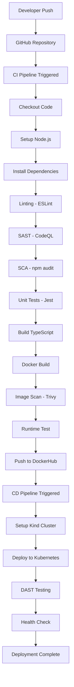

# DevOps CI/CD Project Report

**Student Name:** [Your Name]  
**Student ID:** [Your Student ID]  
**Date:** [Submission Date]

---

## 1. Problem Background & Motivation

### Why CI/CD is Needed
[Explain the importance of CI/CD in modern software development - 1-2 paragraphs]

### Real-world Relevance
[Explain how this project demonstrates real-world DevOps practices - 1-2 paragraphs]

---

## 2. Application Overview

### What the App Does
This project implements a Todo List REST API using TypeScript and Express.js. The application provides endpoints for:
- Creating todos
- Retrieving todos
- Updating todo status
- Deleting todos
- Health check endpoint

### Technology Stack
- **Language**: TypeScript
- **Runtime**: Node.js 18
- **Framework**: Express.js
- **Testing**: Jest
- **Linting**: ESLint
- **Container**: Docker
- **Orchestration**: Kubernetes (Kind)
- **CI/CD**: GitHub Actions

### Key Features
- RESTful API design
- Type-safe code with TypeScript
- Unit tests with Jest
- Containerized with Docker
- Deployed to Kubernetes

---

## 3. CI/CD Architecture Diagram

### Stage Dependencies
- CI stages run sequentially with fail-fast behavior
- CD pipeline only triggers after successful CI completion
- Each security stage acts as a quality gate

---

## 4. CI/CD Pipeline Design & Stages

### CI Pipeline Stages

#### Stage 1: Checkout
**Purpose**: Retrieve source code from repository  
**Tool**: `actions/checkout@v3`  
**Why**: Ensures we have the latest code to build and test

#### Stage 2: Setup Runtime
**Purpose**: Install Node.js runtime environment  
**Tool**: `actions/setup-node@v3` with Node.js 18  
**Why**: Provides the runtime needed to execute TypeScript compilation and tests

#### Stage 3: Linting
**Purpose**: Enforce coding standards and catch style issues  
**Tool**: ESLint with TypeScript plugin  
**Why**: Prevents technical debt, ensures code consistency, maintains readability

#### Stage 4: SAST (Static Application Security Testing)
**Purpose**: Detect code-level security vulnerabilities  
**Tool**: GitHub CodeQL  
**Why**: Identifies OWASP Top 10 vulnerabilities like SQL injection, XSS before deployment

#### Stage 5: SCA (Software Composition Analysis)
**Purpose**: Scan npm dependencies for known vulnerabilities  
**Tool**: `npm audit`  
**Why**: Prevents supply-chain attacks from vulnerable third-party packages

#### Stage 6: Unit Tests
**Purpose**: Validate business logic correctness  
**Tool**: Jest with TypeScript support  
**Why**: Prevents regressions, ensures code quality, validates TypeScript type safety

#### Stage 7: Build
**Purpose**: Compile TypeScript to JavaScript  
**Tool**: `npm run build` (TypeScript compiler)  
**Why**: Creates deployable artifact, validates types, prepares production-ready code

#### Stage 8: Docker Build
**Purpose**: Create containerized application  
**Tool**: Docker multi-stage build  
**Why**: Enables consistent deployment across environments, packages Node.js runtime

#### Stage 9: Image Scan
**Purpose**: Scan Docker image for vulnerabilities  
**Tool**: Trivy  
**Why**: Prevents shipping containers with known OS/library vulnerabilities

#### Stage 10: Runtime Test
**Purpose**: Validate container starts and responds correctly  
**Tool**: Docker run + curl  
**Why**: Ensures image is runnable before pushing to registry

#### Stage 11: Registry Push
**Purpose**: Publish trusted image to DockerHub  
**Tool**: Docker push  
**Why**: Enables downstream CD pipeline to deploy the application

### CD Pipeline Stages

#### Stage 1: Trigger
**Purpose**: Automatically trigger after successful CI  
**Condition**: Only runs if CI pipeline passes

#### Stage 2: Setup Kind
**Purpose**: Create Kubernetes cluster in GitHub Actions  
**Tool**: Kind (Kubernetes in Docker)  
**Why**: Provides free Kubernetes environment for deployment testing

#### Stage 3: Deploy to Kubernetes
**Purpose**: Deploy application to Kubernetes cluster  
**Tool**: kubectl  
**Why**: Demonstrates production-like deployment orchestration

#### Stage 4: DAST
**Purpose**: Test running application for runtime vulnerabilities  
**Tool**: curl-based security tests  
**Why**: Catches issues that SAST misses (misconfigured headers, exposed endpoints)

#### Stage 5: Health Check
**Purpose**: Verify deployment is healthy and accessible  
**Tool**: kubectl + curl  
**Why**: Ensures application is running correctly in Kubernetes

---

## 5. Security & Quality Controls

### SAST Implementation
- **Tool**: GitHub CodeQL
- **Coverage**: Analyzes all TypeScript source code
- **Findings**: Displayed in GitHub Security tab
- **Benefits**: Early detection of code-level vulnerabilities

### SCA Implementation
- **Tool**: npm audit
- **Coverage**: All npm dependencies in package.json
- **Action**: Fails build on moderate+ severity vulnerabilities
- **Benefits**: Prevents supply-chain attacks

### Container Security
- **Tool**: Trivy
- **Coverage**: Complete Docker image scan
- **Findings**: OS packages, application dependencies
- **Benefits**: Prevents vulnerable containers from being deployed

### DAST Implementation
- **Tool**: curl-based security tests
- **Coverage**: Running application endpoints
- **Tests**: Health checks, API endpoints, security headers
- **Benefits**: Validates runtime security posture

### Quality Gates
- Linting must pass (no style violations)
- All unit tests must pass
- No high-severity security vulnerabilities
- Container must start and respond correctly

---

## 6. Results & Observations

### Pipeline Execution Results
[Add screenshots of successful pipeline runs]

### Issues Found and Fixed
[Document any issues encountered during development and how they were resolved]

### Metrics
- **Build Time**: [Time taken]
- **Test Coverage**: [Percentage]
- **Security Findings**: [Number of vulnerabilities found/fixed]
- **Pipeline Success Rate**: [Percentage]

### Screenshots
[Include screenshots of:
- Successful CI pipeline run
- Successful CD pipeline run
- Security scan results
- Kubernetes deployment
- Test coverage report]

---

## 7. Limitations & Improvements

### Current Limitations
1. [List any limitations of the current implementation]
2. [Example: In-memory storage (no database)]
3. [Example: Single replica deployment]

### Future Enhancements
1. **Database Integration**: Replace in-memory storage with PostgreSQL/MongoDB
2. **Multi-replica Deployment**: Scale to multiple pods for high availability
3. **Monitoring**: Add Prometheus and Grafana for metrics
4. **Logging**: Implement centralized logging with ELK stack
5. **Advanced Security**: Add OAuth2 authentication, rate limiting
6. **Blue-Green Deployment**: Implement zero-downtime deployments
7. **Automated Rollback**: Add rollback mechanism on deployment failure

---

## Conclusion

[Summarize the project, key learnings, and how it demonstrates DevOps best practices]

---

## References

- GitHub Actions Documentation: https://docs.github.com/en/actions
- Kind Documentation: https://kind.sigs.k8s.io/
- Docker Documentation: https://docs.docker.com/
- Kubernetes Documentation: https://kubernetes.io/docs/
